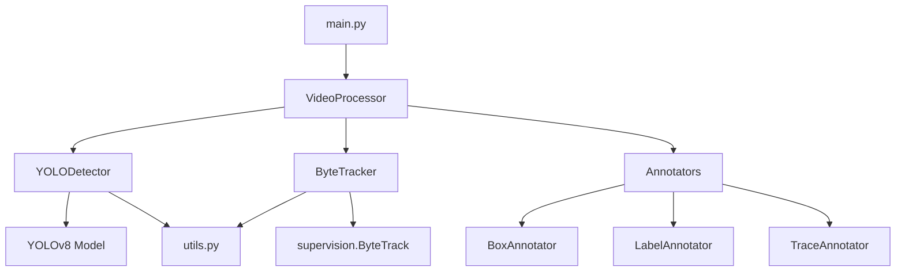

# Project Architecture

## File Responsibilities

| File                     | Role                                             |
| ------------------------ | ------------------------------------------------ |
| `main.py`                | CLI entry point, parses arguments                |
| `src/detector.py`        | Loads YOLOv8, runs inference, returns detections |
| `src/tracker.py`         | Wraps ByteTrack, assigns persistent IDs          |
| `src/video_processor.py` | Orchestrates detect → track → annotate → save    |
| `src/utils.py`           | Device selection, label formatting               |

## Data Flow

```
Input Video
    ↓
main.py  (args: source, model, conf, classes)
    ↓
VideoProcessor
    ├── YOLODetector  →  raw detections (xyxy, confidence, class_id)
    ├── ByteTracker   →  adds tracker_id to each detection
    └── Annotators    →  draws boxes, labels, motion traces
    ↓
Output Video
```

## Key Dependencies

| Library     | Role                         |
| ----------- | ---------------------------- |
| YOLOv8      | Object detection             |
| supervision | ByteTrack + annotation tools |
| OpenCV      | Video read/write             |
| PyTorch     | Inference backend            |

## Visual Diagram


